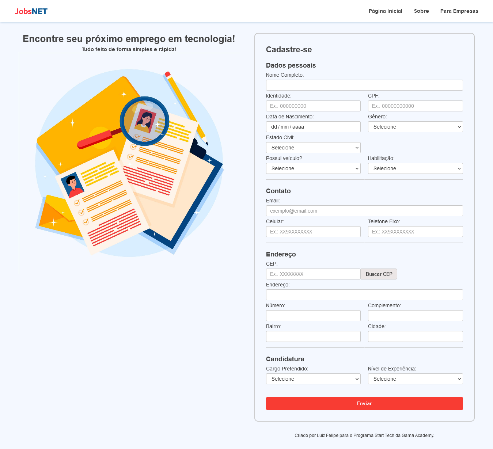

# Banco de currículos JobsNET

Este projeto é a minha solução para o desafio final do Programa Start Tech da [Gama Academy](https://www.gama.academy/).

O programa consistiu em 5 semanas de treinamento fullstack, com aulas assíncronas e mentorias, além da realização de avaliações e assignments. Para a sua finalização, desenvolvemos o front e o back end de uma aplicação, a qual apresento aqui.

É possível acessar a aplicação clicando [aqui](https://jobsnet-project.netlify.app/).

## Sumário

- [Visão Geral](#visão-geral)
  - [O Desafio](#o-desafio)
  - [Screenshots](#screenshots)
- [Desenvolvimento](#desenvolvimento)
  - [Ferramentas utilizadas](#ferramentas-utilizadas)
  - [Lições aprendidas](#lições-aprendidas)
  - [Melhorias futuras](#melhorias-futuras)
  - [Recursos úteis](#recursos-úteis)
- [O Autor](#o-autor)

## Visão Geral

### O Desafio

Foram passadas as seguintes informações:

"A empresa JobsNET especialista em recrutamento e seleção de  profissionais nas mais diversas áreas solicitou para a nossa fábrica de  software desenvolver uma página para atração de profissionais para  conectar as oportunidades de emprego."

<u>Para o Frontend era necessário:</u>

1. Apresentar a estrutura do projeto no github
2. Criar uma landing page (sem regras para o layout) com formulário para preenchimento de candidatura
3. Hospedar a página

<u>Para o Backend:</u>

1. Cadastro de candidatos com os campos: Id, Nome, Data Nascimento, Estado Civil, Gênero, Endereço, Telefone, Email, Documentos e Profissão
2. Utilizar a API VIA Cep para consultar o endereço através do CEP informado pelo usuário

<u>Regra de Negócio:</u>

1. Não pode haver 2 cadastros de candidatos com o mesmo CPF
2. Todo candidato precisará preencher os campos: CPF, Nome, Data Nascimento,  Cep, Logradouro, Número, Bairro, Cidade, Email, Profissão e Celular

<u>Integração entre a página e o Backend:</u>

1. Disponibilizar uma API Rest com a funcionalidade de cadastro de candidatos armazenando em um banco de dados
2. Disponibilizar a documentação dos recursos Web Services REST - Uso do Swagger

### Screenshots

Abaixo há uma screenshot da landing page criada.

Visualização da página no desktop

## Desenvolvimento

### Ferramentas utilizadas

Para criação do projeto foi utilizada a stack MERN, que consiste no banco de dados não relacional MongoDB, no framework Express, na biblioteca React e ambiente Node.JS.

Além disso, foram utilizados os pacotes:

- [axios ](https://www.npmjs.com/package/axios) para as requisições HTTP
- [cors](https://www.npmjs.com/package/cors) para permitir CORS
- [formik](https://formik.org/) para criação do formulário
- [gerador-validador-cpf](https://www.npmjs.com/package/gerador-validador-cpf) para validação dos CPFs inseridos pelos usuários
- [styled-components](https://styled-components.com/) para estilização de alguns componentes React
- [swagger-ui-express](https://www.npmjs.com/package/swagger-ui-express) para a documentação da API
- [uuid](https://www.npmjs.com/package/uuid) para geração das Ids dos usuários
- [yup ](https://www.npmjs.com/package/yup) para validação dos dados submetidos pelo usuário

### Lições aprendidas

Decidi começar com o desenvolvimento da landing page, iniciando pela primeira vez um projeto React com o create-react-app. Com isso, organizei o diretório do projeto, desenvolvi a estrutura básica do formulário com o formik, adicionei as validações necessárias para os inputs e componetizei os demais elementos presentes na página. Todos estes pontos eram novos para mim, portanto pude entender melhor o funcionamento, vantagens e utilização de componentes react ao invés de tags feitas em HTML puro.

Após isto, fui para o desenvolvimento do backend do projeto montando a estrutura de rotas, configurando o cors e a conexão com o banco MongoDB e incluindo as validações e tratamento de dados necessários. Este projeto contém apenas a rota "register", utilizada para submissão dos dados com o método POST. Por ser a primeira vez tendo contato com um backend, foi interessante entender o funcionamento e a comunicação feita com um banco de dados, também a programação da API para comunicação, além da integração de front e back.

### Melhorias futuras

- Adicionar uma página de confirmação pós cadastro
- Entender melhor a organização de um monorepo e realização do deploy
- Adicionar responsividade à aplicação

### Recursos úteis

Além das documentações específicas de cada item, os seguintes recursos tiveram grande contribuição.

[Curso de React](https://www.youtube.com/watch?v=ErjWNvP6mko) - me auxiliou a iniciar um projeto React e lidar com componentes da maneira certa.

[Criação de API com Node.js](https://www.youtube.com/watch?v=_imMNCUQ6uA) - onde pude entender corretamente como programar uma API com o Node.js.

[Documentação com Swagger](https://www.youtube.com/watch?v=WhFx2heoFrA) - com este tutorial vi o que era necessário para uma documentação de API bem feita.

[StackOverflow](https://stackoverflow.com/) - que me ajudou a resolver algumas questões específicas.

[Tutorial de consumo de API](https://www.youtube.com/watch?v=imk6Y0viabg) - este tutorial me auxiliou no consumo da API Via cep solicitada no desafio.

[Tutorial de Deploy e Host](https://www.youtube.com/watch?v=Z_D4w6HmT8k) - me auxiliou na finalização do desafio ao fazer o host e deploy do projeto.

[Utilização do Formik](https://www.youtube.com/watch?v=NcMsGS2_87U) - neste tutorial aprendi a utilizar os componentes próprios do Formik que facilita a montagem de formulários.

[Vídeo sobre Styled Components](https://www.youtube.com/watch?v=QdfjWRc4ySA) - tutorial que me ajudou a entender como estilizar componentes com o uso do styled components.

## O Autor

Projeto desenvolvido por Luiz Felipe, abaixo deixo meu Github com alguns projetos que realizei, meu LinkedIn e contato.

Github - [lufesipe](https://github.com/lufesipe)

LinkedIn - [Luiz Felipe](https://www.linkedin.com/in/luiz-felipe-sp)

Email - [luizfspereira@outlook.com](mailto:luizfspereira@outlook.com)

